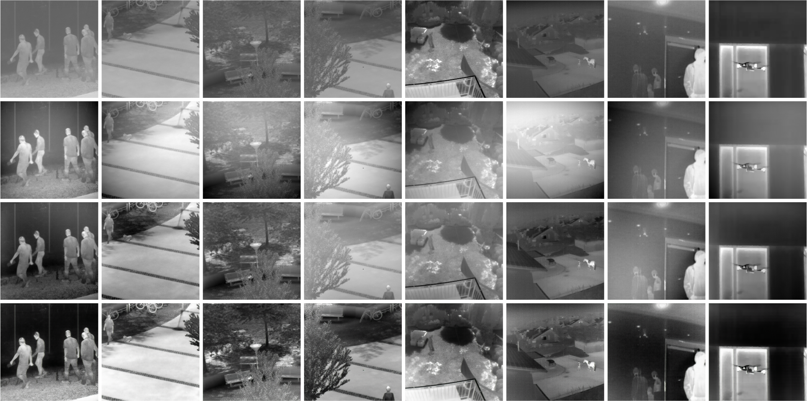

# Single infrared image optical noise removal using a deep convolutional neural network

- Torch implementation for learning a mapping from input images to output images
- Our code refers to [[pix2pix]](https://github.com/phillipi/pix2pix)
- Note that we remove the dropout layers in the decoder, as we have enough large dataset to avoid overfitting.




## Setup

### Prerequisites
- Linux
- NVIDIA GPU + CUDA CuDNN

### Getting Started
- Install torch and dependencies from https://github.com/torch/distro
- Install torch packages `nngraph` and `display`
```bash
luarocks install nngraph
luarocks install https://raw.githubusercontent.com/szym/display/master/display-scm-0.rockspec
```
- Download this repo, unzip ONR-master,then
```bash
  cd ONR-master
```

- Download the network that has been trained and put it under the folder 'checkpoints/OP/unet_L1+cGAN/'

  [[latest_net_G.t7]](https://drive.google.com/file/d/0B3pG20Tbq8Nec09LV3lSMDJSWDA/view)


## Test
```bash
DATA_ROOT=datasets/OP/ name=unet_L1+cGAN which_direction=BtoA phase=val_0.002 th test.lua
```
Result images, and a webpage to view them, are saved to `./results/OP/unet_L1+cGAN` .

## Train
```bash
DATA_ROOT=datasets/OP/ name=unet_L1+cGAN which_direction=BtoA th train.lua
```

## Setup Training and Test data
### Generating Pairs
We provide a python script to generate training data in the form of pairs of images {A,B}, where A and B are two different depicitions of the same underlying scene. Then we can learn to translate A to B or B to A:

Create folder `/datasets/OP/` with subfolders `A` and `B`. `A` and `B` should each have their own subfolders `train`, `val`, `test`, etc. In `/datasets/OP/A/train`, put training images in style A. In `/datasets/OP/B/train`, put the corresponding images in style B. Repeat same for other data splits (`val`, `test`, etc).

Corresponding images in a pair {A,B} must be the same size and have the same filename, e.g. `/datasets/OP/A/train/1.jpg` is considered to correspond to `/datasets/OP/B/train/1.jpg`.

Once the data is formatted this way, call:
```bash
python scripts/combine_A_and_B.py --fold_A /path/to/data/A --fold_B /path/to/data/B --fold_AB /path/to/data
```
## Contact with me
If you have any questions, please contact with me. (1007642157@qq.com)
